# 🛡️ NHIT Backend: The Core Infrastructure

This repository contains the foundational microservices for the NHIT ecosystem. It is responsible for identity management, organizational hierarchy, administrative data, and the unified API entry point.

---

## 🏗️ Internal Architecture Flow
The Backend repository operates on a **Gateway-to-Service** gRPC pattern. All external traffic enters through the Gateway, which manages authentication before routing to internal services.

```mermaid
graph TD
    %% Entry Point
    WebClient[🌐 Web/Mobile Client] -->|REST / HTTP| Gateway[🛡️ API Gateway :8080]

    %% Authentication Path
    subgraph "Identity Layer"
        Gateway -->|Verify| Auth[🔐 Auth Service :50052]
        Auth -->|Lookup| User[👤 User Service :50051]
        Auth -->|Cache| RedisPool[(⚡ Redis Auth Cache)]
    end

    %% Administrative Path
    subgraph "Organization & Setup"
        Gateway --> Org[🏢 Organization :50053]
        Gateway --> Dept[📂 Department :50054]
        Gateway --> Desig[🏷️ Designation :50055]
    end

    %% Resource Path
    subgraph "Operational Data"
        Gateway --> Proj[🏗️ Project :50057]
        Gateway --> Vend[🤝 Vendor :50058]
    end

    %% Storage
    Auth & User & Org & Dept & Desig & Proj & Vend --> MasterDB[(🗄️ Master Postgres :5433)]
```



---

## 📦 Services Overview

### 1. **API Gateway (:8080)** 🛡️
The brain of the backend. It performs:
- **JWT Middleware**: Validates tokens against `Auth-Service`.
- **Context Injection**: Injects `OrgID`, `TenantID`, and `UserID` into gRPC headers.
- **REST-to-gRPC**: Translates clean HTTP calls into binary gRPC requests.

### 2. **Auth Authority (:50052)** 🔐
Handles the security lifecycle:
- Login/Logout logic.
- Password hashing using BCrypt.
- Session persistence in Redis for high-speed verification.

### 3. **Identity & Org Management**
- **User Service (:50051)**: Role-Based Access Control (RBAC) and profile data.
- **Organization Service (:50053)**: Multi-tenant structural definitions.
- **Department/Designation**: Fine-grained staff categorization.

---

## 🛠️ Local Development
To run the core backend, ensure the infrastructure is up first.

### 1. Launch Infra
```bash
docker-compose --profile infra up -d
```

### 2. Run a Service
```bash
# Example: Starting the User Service
cd services/user-service
go run ./cmd/server/main.go
```

---

## 📂 Project Structure
- `api/proto/`: Central repository for all gRPC Protocol Buffers.
- `pkg/`: Shared libraries for Database connection, Middleware, and Logging.
- `services/`: Implementation of each microservice.

---

> [!NOTE]
> This repository provides gRPC endpoints for the **Nhit-Note** (GreenNote) repository to validate projects and vendors.
