# 📝 Nhit-Note: The Business Logic Engine

This repository is the "Heart" of the Nhit ecosystem. It manages all specialized financial and project workflows, including Green Notes, Payment Notes, and Reimbursements. It is designed to handle complex state transitions and multi-tier approval logic.

---

## ⚡ Workflow Architecture
The services in this repository are **Validators**. They don't just save data; they coordinate with the Base Backend to ensure every note is compliant with organization rules.

```mermaid
graph TD
    %% Entry via Gateway
    Gateway[🛡️ API Gateway] -->|Request| GN[📄 GreenNote Service :50059]
    Gateway -->|Request| PN[💰 PaymentNote Service]
    Gateway -->|Request| RE[💸 Reimbursement]

    %% Validation Dependency (Cross-Repo)
    subgraph "Core Dependencies (NHIT Backend Repo)"
        Proj[🏗️ Project Service]
        Vend[🤝 Vendor Service]
    end

    GN -.->|gRPC: Validate Budget| Proj
    GN -.->|gRPC: Validate Dealer| Vend
    PN -.->|gRPC: Check Vendor| Vend

    %% Logic Processing
    GN & PN & RE --> Appr[✅ Approval Engine]
    Appr --> DB[(🗄️ Notes Database)]

    %% Event Trigger
    Appr -- "Approval Status Changed" --> Kafka{{✉️ Kafka Message Bus}}
    Kafka -- "green_note_events" --> Notify[📧 Notification Repo]
```



---

## ⚙️ Core Modules

### 1. **GreenNote Service** 📄
The primary tool for project-related expenses.
- **Auto-Validation**: Instantly checks project budgets in the Backend repo.
- **Version Control**: Tracks changes made to notes during the approval process.

### 2. **Payment & Reimbursement Services** 💰
- **Payment Service**: Specialized for large vendor payouts.
- **Reimbursement**: Handles employee expense claims.
- **PO Tracking**: Links notes to Purchase Orders for 100% auditability.

### 3. **The Approval Engine** ✅
A generic, state-driven engine that:
- Manages voting levels (e.g., Level 1 Manager → Level 2 Director).
- Enforces quorum and majority rules for approvals.

---

## 🚦 Integration with Backend
This repository relies heavily on the **NHIT Backend**. To function correctly, it expects:
- **JWT Context**: Authentication headers must be present.
- **gRPC Targets**: The `Project` and `Vendor` services must be reachable via the internal network.

---

## 🛠️ Local Development
1. Ensure `NHIT Backend` is running.
2. Run the specialized service:
```bash
cd services/greennote-service
go run ./cmd/server/main.go
```

---

> [!TIP]
> **Data Integrity**: Always sync your `.proto` files with the Backend repo to avoid gRPC compatibility issues.
