# <div align="center">🚀 NHIT Ecosystem: The Master Blueprint</div>
<div align="center"><b>A High-Performance Microservices Architecture for Enterprise Automation</b></div>

<div align="center">
  
  
  
  
</div>

---

## 🏛️ Ecosystem Architecture
NHIT is a multi-repository ecosystem designed to handle every aspect of an organization's workflow—from identity management to complex financial approvals. This document covers all three core components of the system.

### 🌐 The Topological Map
The diagram below visualizes how the three repositories interact to form a single cohesive platform.

```mermaid
graph TD
    subgraph "🏢 Repository 1: NHIT Backend (Core)"
        Gate[🛡️ API Gateway :8080]
        Auth[🔐 Auth Service]
        User[👤 User Service]
        Org[🏢 Org Service]
        Dept[📂 Dept Service]
        Desig[🏷️ Desig Service]
        Proj[🏗️ Project Service]
        Vend[🤝 Vendor Service]
    end

    subgraph "📝 Repository 2: Nhit-Note (Business)"
        GN[📄 GreenNote Service]
        Appr[✅ Approval Service]
    end

    subgraph "📧 Repository 3: notification-service (Support)"
        Worker[⚙️ Notification Worker]
    end

    %% Sync Communication (gRPC)
    Gate --> Auth & User & Org & Dept & Desig & Proj & Vend & GN
    GN -- "Validate" --> Proj
    GN -- "Validate" --> Vend
    GN -- "Vote" --> Appr
    Auth -- "Verify" --> User

    %% Async Communication (Kafka)
    Auth & GN -- "Topic: notification_mails" --> Kafka((✉️ Kafka))
    Kafka --> Worker
```



---

## 📂 Multi-Repository Directory Structure
| Repository | Role | Key Services |
| :--- | :--- | :--- |
| **`NHIT Backend`** | **The Core Foundation** | Auth, User, Org, Dept, Desig, Project, Vendor, Gateway. |
| **`Nhit-Note`** | **The Business Engine** | GreenNote workflows, Multi-level approvals. |
| **`notification-service`**| **The Message Hub** | Asynchronous email processing (OTP, Alerts, Success). |

---

## 📦 Global Service Registry
Every service is optimized for specific business needs. Here is the full granular mapping:

### 🏠 Core Services (NHIT Backend)
| Service | Port | Specific Job |
| :--- | :--- | :--- |
| **API Gateway** | `8080` (REST) | Protocol translation (REST ↔ gRPC), JWT verification, Routing. |
| **Auth Service** | `50052` | Session management, BCrypt hashing, Token generation. |
| **User Service** | `50051` | Identity management, Roles, and Permissions. |
| **Organization Service**| `50053` | Multi-tenant company hierarchy (Head Office vs Branch). |
| **Department Service** | `50054` | Division management within organizations. |
| **Designation Service** | `50055` | Staff title and seniority hierarchy. |
| **Project Service** | `50057` | Site management, budget tracking, and status. |
| **Vendor Service** | `50058` | Supplier KYC, banking details, and compliance data. |

### 📄 Workflow Engine (Nhit-Note)
| Service | Port | Specific Job |
| :--- | :--- | :--- |
| **GreenNote Service** | `50059` | Lifecycle of approval notes (Draft → Pending → Approved). |
| **Approval Service** | `50060`* | Multi-tier voting logic and transition management. |

### 📧 Messaging (notification-service)
- **Role**: Backend worker that consumes events from Kafka.
- **Topics**: `notification_mails`, `green_note_events`, `auth_events`.
- **Function**: Sends SMTP emails for OTPs, Password Resets, and Approval Alerts.

---

## ⚡ Cross-Repo Workflows

### 1. The Green Note Journey
This workflow demonstrates the interplay between **Nhit-Note** and **NHIT Backend**:
1.  **User Submission**: User hits `Nhit-Note` API via Gateway.
2.  **Cross-Repo Sync**: `GreenNote-Service` makes a gRPC call to `Project-Service` (Backend Repo) to verify budget.
3.  **Approval Flow**: `Approval-Service` initiates a multi-level voting flow.
4.  **Notification**: Upon status change, a message is fired to **Kafka**.
5.  **Email**: The **Notification-Service** picks up the message and sends an email to the User.

---

## 🛠️ Global Setup Guide

### 🚀 Step 1: Infrastructure (Shared)
```bash
cd "d:\Nhit\NHIT Backend"
docker-compose --profile all up -d  # Starts Postgres, Kafka, Redis, MinIO
```

### 🛰️ Step 2: Running the Ecosystem
You typically need at least the Gateway and User service + the specific service you are testing.
```powershell
# In separate windows:
go run d:\Nhit\NHIT Backend\services\user-service\cmd\server\main.go
go run d:\Nhit\NHIT Backend\services\api-gateway\cmd\server\main.go
go run d:\Nhit\Nhit-Note\services\greennote-service\cmd\server\main.go
```

---

## ❓ Troubleshooting & FAQs

> [!IMPORTANT]
> **Inter-service Auth**: The Gateway injects `OrgID` and `UserID` into any gRPC call. If you hit services directly (bypassing the Gateway), you MUST manually set these in the gRPC Metadata/Headers.

| Scenario | Fix |
| :--- | :--- |
| **Email not arriving** | Check `notification-service` logs. Ensure Kafka topic `notification_mails` exists. |
| **GreenNote Creation Fail** | Ensure `Project-Service` and `Vendor-Service` are both running (gRPC dependency). |
| **JWT Invalid** | Ensure `SECRET_KEY` is identical across `auth-service` and `api-gateway`. |

---

<div align="center">
  <sub>Fully Documented NHIT Ecosystem | Integrated Backend, Note, & Notifications</sub>
</div>
